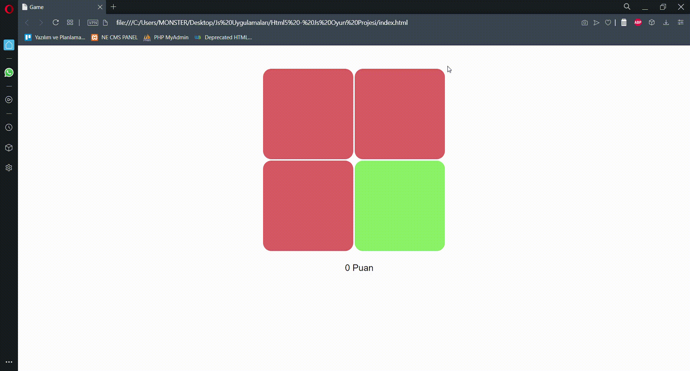

# Html5-Css3-Js-Basic-Color-Game
I've applied game project from "Html Css and Js Web Design" book of Burak Tokak. This is a simple Html5 game project developed with Js. Base logic in game is that score is increasing 10 as the player clicks the different color of block,decreasing 20 points as player click one of three same color of blocks.

